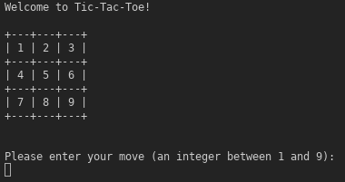

# tic_tac_toe
-   [Reference used for making this game] (https://www.ibm.com/developerworks/library/os-using-rust/index.html)

-   This a learning project for Rust begineers.

-   Game console view:

    